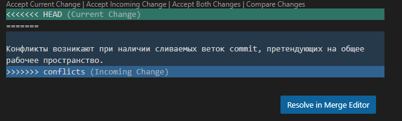

# Second Seminar. Branches

## Creating Branch

* **_git checkout_** branch_name - позволяет переключатся между рабочими ветками  (ветка на которую необходимо осуществить переход задается в branch_name0) 

**Дополнительно** В левом нижнем углу экрана приложения **Visual Studio Code** указано название ветки, в которой вы находитесь на данный момент.

* **_git branch_** - команда отображающая список существующих веток, так же отмечает наше текущее расположение значком * 

**Пример:**

PS C:\путь проекта> git branch
* creating

  master

#
* **_git branch_** branch_name* -  позволяет создать новую ветку для последующего использования в работе. 

## Merging Branch

* **_git merge_** *branch_name*  - позволяет выполнить слияние текущей ветки и ветки, которая будет указана в названии (branch_name). 

**Дополнительно** |Auto-Merging| Merge made "ort" strategy - автоматическое слияение веток, при условии что используются уникальные commit. А так же после слияния master автоматически добавляет +1 commit с описанием объединения веток.

* **_git branch_** -d branch_name - позволяет удалять ветку, указанную в названии **ВАЖНО** Не рекомендуется удалять ветку, если в ней есть данные, которые вам нужны.

## Conflicts

Конфликты возникают при наличии сливаемых веток commit, претендующих на общее  рабочее пространство.

**Пример** 

